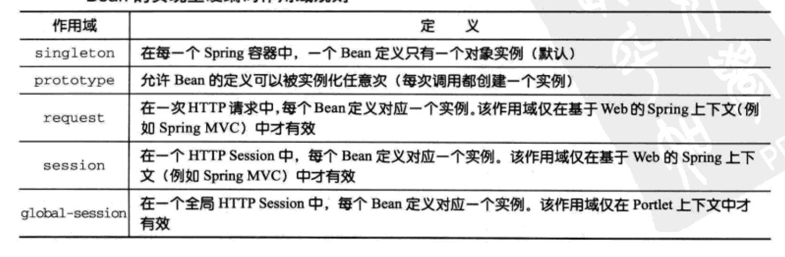

所有的Spring Bean默认都是单例，当容器分配一个bean时（不论通过装配还是调用容器的getBean()方法），它总是返回同一个实例。

为了让spring在每次请求时都为Bean产生一个新的实例，我们需要配置bean的scope属性为prototype
<bean id="ticker" class="com.spring.Ticket" scope="prototype" />

